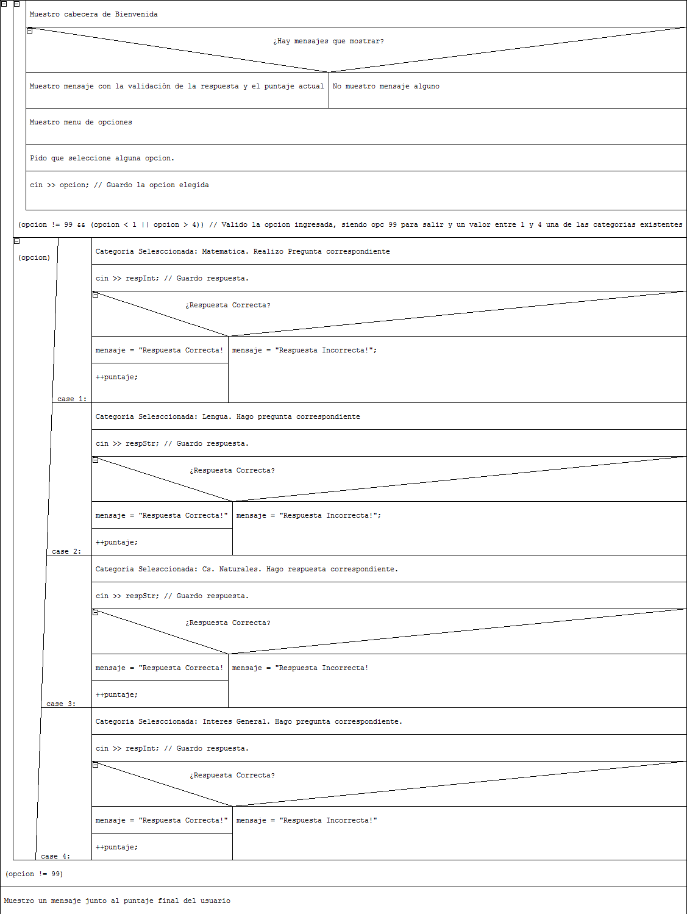

# AED-TP3-JuegoInteractivo
TP N° 3 de AED - UTN FRBA - Alumno: Ferreyra, Maximiliano Gastón - Curso: K1091.

####***Diagrama Nassi-Shneiderman***

####***Ventajas y desventajas de los tipos de diagramas***

######Diagramas Nassi-Shneiderman

**Ventajas:**

+ Útil en la enseñanza de los conceptos básicos de la Programación estructurada.
+ Se puede visualizar mejor las diferencias entre un bloque "do-while" y un "while".

**Desventajas**

+ Ocupan demasiado ancho de pantalla.
+ Su manejo se complica a medida que la complejidad del algoritmo aumenta.
+ No suelen utilizarse en el ámbito profesional.

___

######Diagramas de Flujo.

**Ventajas:**

+ Sumamamente estandarizado.
+ Útiles para la detección de errores.
+ Fácil edición posterior.
+ Ampliamente utilizado en el ámbito profesional.

**Desventajas**

+ Complejos de realizar.
+ Confusos en la representación de algortimos complejos.

___

######Seudocódigo.

**Ventajas:**

+ Facilidad en conversión de código verdadero.
+ Portable por ser texto plano.

**Desventajas**

+ No estandarizado. Queda al criterio del desarrollador del mismo.
+ Visualmente menos intuitivo que los demas diagramas.

___

######C++.

**Ventajas:**

+ Con correcta indentación es sencillo de seguir.
+ Los comentarios en línea ayudan al entendimiento y seguimiento del código.

**Desventajas**

+ Comunmente un programa se compone de varios archivos fuente o utilización de bibliotecas externas, dificultando el seguimiento del código.